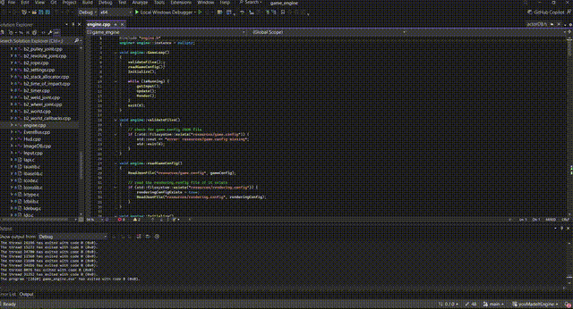

# youMadeItEngine

A custom 2D game engine built from scratch in C++ with Lua scripting, Box2D physics, and SDL2 rendering. Designed around a modular actor-component architecture that keeps gameplay logic cleanly separated from engine systems.

Built as a capstone project for the Game Engine Development course at the University of Michigan.



---

## Features

**Actor-Component System** — Actors are composed of reusable components defined in Lua. Attach a `Rigidbody`, a `SpriteRenderer`, and a `KeyboardControls` to an actor through JSON templates — no C++ recompilation needed to change gameplay behavior.

**Lua Scripting** — Full runtime scripting API exposed to Lua via LuaBridge. Components implement lifecycle callbacks (`OnStart`, `OnUpdate`, `OnLateUpdate`, `OnDestroy`) and physics callbacks (`OnCollisionEnter`, `OnCollisionExit`, `OnTriggerEnter`, `OnTriggerExit`) to drive game logic.

**Deterministic Physics** — Box2D integration with fixed timestep ensures reproducible physics behavior across runs, making debugging and automated testing straightforward.

**Scene Management** — JSON-based scene files define actor compositions. Scenes load at runtime with caching for instant revisits. Supports both hand-authored `.scene` files and Tiled editor `.json` maps with tile layers, object layers, and collision data.

**Tiled Editor Support** — Import maps and tilesets directly from the [Tiled](https://www.mapeditor.org/) map editor. The engine parses tile layers for rendering and object layers for actor spawning, enabling visual level design outside of code.

**Template System** — Actor templates are JSON files that define reusable actor archetypes. Instantiate them at runtime from Lua with `Actor.Instantiate("TemplateName")`.

**Automated Testing** — Pytest-based test suite with 150+ test cases validating configuration integrity, physics determinism, component wiring, and regression baselines. CI pipeline runs the full suite on every push.

---

## Project Structure

```
youMadeItEngine/
├── game_engine/
│   ├── src/                        # Engine source code (C++)
│   │   ├── main.cpp                # Entry point
│   │   ├── engine.cpp / .h         # Core game loop and initialization
│   │   ├── actorDB.cpp / .h        # Actor-component system and physics
│   │   ├── EventBus.cpp / .h       # Event publish/subscribe system
│   │   ├── ImageDB.cpp / .h        # Sprite loading and rendering
│   │   ├── AudioDB.cpp / .h        # Audio playback (SDL_mixer)
│   │   ├── Input.cpp / .h          # Keyboard and mouse input
│   │   ├── SceneDB.cpp / .h        # Scene loading and camera
│   │   ├── TemplateDB.cpp / .h     # Actor template loading
│   │   ├── TextDB.cpp / .h         # Text rendering (SDL_ttf)
│   │   ├── Tiled.cpp / .h          # Tiled map/tileset parsing
│   │   └── Hud.cpp / .h            # HUD overlay system
│   │
│   ├── resources/                  # Runtime game data
│   │   ├── game.config             # Game title, initial scene
│   │   ├── rendering.config        # Resolution, clear color, zoom
│   │   ├── scenes/                 # Scene definitions
│   │   ├── actor_templates/        # Reusable actor archetypes
│   │   ├── component_types/        # Lua component scripts
│   │   └── images/                 # Sprite assets
│   │
│   ├── tests/                      # Pytest test suite
│   └── game_engine.vcxproj         # Visual Studio project
│
├── includes/                       # Third-party headers and source
│   ├── box2d-2.4.1/               # Box2D physics (headers + source)
│   ├── glm-0.9.9.8/               # GLM math library
│   ├── lua/                        # Lua interpreter
│   ├── LuaBridge/                  # C++ to Lua binding
│   ├── rapidjson-1.1.0/           # JSON parser
│   ├── windows/                    # SDL2 headers + libs (Windows)
│   └── mac/                        # SDL2 headers + libs (macOS)
│
├── .github/                        # CI workflows (GitHub Actions)
├── game_engine.sln                 # Visual Studio solution
├── Makefile                        # Linux/macOS build
└── Jenkinsfile                     # Jenkins CI pipeline
```

---

## Tech Stack

| Layer | Technology |
|---|---|
| Language | C++17 |
| Scripting | Lua 5.4 via LuaBridge |
| Physics | Box2D 2.4.1 |
| Rendering | SDL2, SDL2_image, SDL2_ttf |
| Audio | SDL2_mixer |
| Data | RapidJSON |
| Math | GLM |
| Level Design | Tiled map editor |
| Testing | Pytest, GitHub Actions, Jenkins |

---

## Building

### Visual Studio (Windows)

Open `game_engine.sln` and build the project (Debug|x64). SDL2 libraries are bundled in `includes/windows/`.

### Makefile (Linux / macOS)

```bash
make
./game_engine_linux
```

Requires SDL2, SDL2_image, SDL2_ttf, and SDL2_mixer installed on the system.

---

## How It Works

The engine runs a straightforward game loop: **Input → Update → Render**.

Each frame, the engine polls SDL events and forwards them to the input system. During the update phase, every actor's Lua components receive their lifecycle callbacks in order — `OnStart` for newly added components, then `OnUpdate` for all active ones. Box2D steps the physics world, and collision callbacks fire into Lua. Finally, the render phase draws tiled backgrounds, sprites, and HUD elements in layer order.

Scenes are hot-swappable at runtime. Call `Application.LoadScene("sceneName")` from any Lua script to transition. Actors marked with `Application.DontDestroy(actor)` persist across scene loads.

---

## Demo Game

The included demo is a small platformer that exercises the engine's core systems. A player character navigates a tile-based level with static platforms, bouncy surfaces, and a victory zone — all defined in Lua and spawned from templates by the `GameManager` component.

---

## Author

**Hagen Carriere**
University of Michigan — Computer Science Engineering, 2025

[hagen-carriere.github.io](https://hagen-carriere.github.io) · [LinkedIn](https://www.linkedin.com/in/hagen-carriere-74424226a/)
